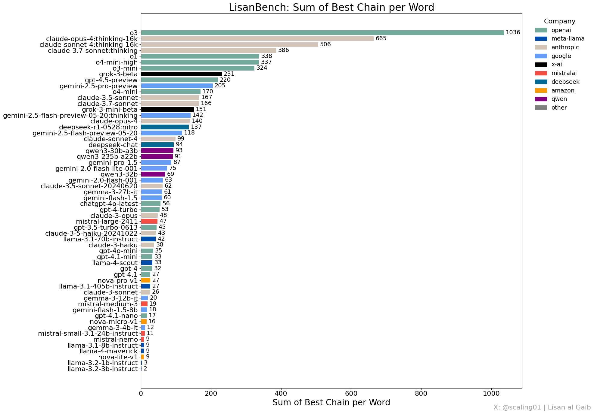
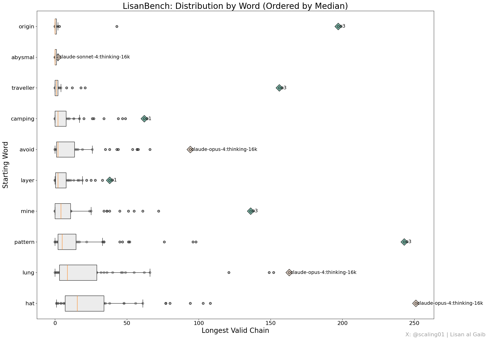

# LisanBench

> **“Lisan”** (as in *Lisan al-Gaib*) means “tongue” or “language” in Arabic. So, LisanBench literally translates to
*Language Bench*.

**LisanBench** is a lightweight, *cheap-to-run* benchmark for large language models that stresses **forward planning**,
**vocabulary depth**, **constraint adherence**, **attention**, and long-context **"stamina"** all at once.

Most traditional academic benchmarks like MMLU, MATH, AIME, or HumanEval are saturated and skewed toward niche domains.
They also
don’t correlate well with general intelligence or practical model utility.

Community-developed benchmarks
like [AidanBench](https://github.com/aidanmclaughlin/AidanBench), [SOLOBench](https://github.com/jd-3d/SOLOBench), [SimpleBench](https://github.com/simple-bench/SimpleBench),
or [Thematic Generalization](https://github.com/lechmazur/generalization) tend to capture those
qualities better. A core theme in those is **emergent complexity** from **simple problem scaling**.

LisanBench follows that principle. Inspired by these and co-developed with Claude-4 Opus, it introduces a novel twist on
Lewis Carroll’s 1877 game *Word Ladder*.

📖 **[Full announcement thread on X for more details](https://x.com/scaling01/status/1928510435164037342)**

---

## How It Works

In classic *Word Ladder*, you transform a start word into a target word, changing one letter at a time to create valid
intermediate words.

> “Each step consists of a single letter substitution, forming a new valid word.”  
> *[Wikipedia](https://en.wikipedia.org/wiki/Word_ladder)*

LisanBench uses an **open-ended variant** without a target word and Levenshtein-, instead of Hamming-distance:  
Each word in the chain must differ from the previous one by a **Levenshtein distance of 1** (i.e., one insert, delete,
or substitution), all intermediate words have to be in the dictionary and **no repetitions are allowed**.

**Example chain starting from "hat":**

```
hat → bat → bit → sit → wit → win → bin → ...
```

Models are scored on **10 starting words** of increasing difficulty: from *hat* (72 neighbors at Levenshtein distance 1)
to *abysmal* (only 1 neighbor).

### Default Starting Words

```python
["hat", "mine", "lung", "layer", "pattern", "camping", "avoid", "traveller", "origin", "abysmal"]
```

The final score is the **sum of the longest valid chains** across all starting words.

> 🔁 For better accuracy, average over **5+ trials per word** and/or use more starting words. This increases cost but
> greatly
> improves score stability, especially for weaker models.

---

## Why Is This Challenging?

At its theoretical limit, LisanBench
approaches the **NP-hard "[Longest Simple Path Problem](https://en.wikipedia.org/wiki/Longest_path_problem)"**, giving
it practically indefinite scaling potential and skill ceiling.
The benchmark operates within the largest connected component of the
English language graph (108,448 words from the [dwyl/english-words](https://github.com/dwyl/english-words) dictionary),
where nodes are words and edges connect words with Levenshtein distance = 1.

**Scaling advantage:**  
This benchmark rewards both **test-time compute** and **model size**, but models with explicit reasoning capabilities
have a distinct edge. Non-reasoning models must depend purely on implicit, latent reasoning and are therefore much more
likely to hit dead-ends. Larger models get boosts from broader vocabulary memorization, deeper
task comprehension, smarter heuristics, and better tokenization. But raw size isn’t enough: models also need precise
recall of previously used words and **output stamina** - the ability to keep generating long, uninterrupted sequences
without cutting off too soon.

To excel, top models need more than brute force: they have to leverage heuristics, local search, and backtracking
to escape dead-end traps and low-connectivity regions. This requires extensive multi-step planning to navigate the
narrow paths
through the word graph.

**What makes LisanBench unique is the simultaneous stress-testing of several core abilities:**

- **Strategic Planning:** Models must anticipate several moves ahead to avoid dead-ends and discover viable routes in a
  tight word space.
- **Vocabulary Depth:** Knowledge of both common and obscure words is vital for extending chains.
- **Recall:** The inability to repeat words across potentially hundreds of steps makes this a test of long-range memory.
- **Constraint Adherence & Task Understanding:** Models must strictly enforce the Levenshtein distance = 1 rule - no
  shortcuts or loose approximations.
- **Sustained Generation:** Cohesive, rule-abiding output must be maintained over long sequences without early stopping
  or breaking constraints.


*Complete leaderboard results - cost less than $50 for 58 models evaluated with 1 trial per word*

## Repository Structure

| File/Directory            | Purpose                                                           |
|---------------------------|-------------------------------------------------------------------|
| `main.py`                 | CLI entry point - orchestrates benchmark execution and results    |
| `lisan_bench.py`          | Core benchmark orchestration and execution logic                  |
| `completions.py`          | Thread-safe OpenRouter client with usage/cost tracking            |
| `model_list.py`           | List of supported OpenRouter model identifiers                    |
| `starting_word_picker.py` | Generate diverse starting words with varying difficulty           |
| `visualization.py`        | Generate comprehensive plots and save to `/plots`                 |
| `utils.py`                | Core utilities including prompts and helper functions             |
| `assets/`                 | Pre-rendered figures and visualizations                           |
| `.env`                    | **You must create this** - Contains your API keys (never commit!) |

## Quick Start

### 1. Installation

```bash
# Clone the repository
git clone https://github.com/voice-from-the-outer-world/lisan-bench.git
cd lisan-bench

# Set up virtual environment
python -m venv .venv && source .venv/bin/activate

# Install dependencies
pip install -r requirements.txt
```

### 2. API Key Setup

Create a `.env` file in the project root:

```bash
# Add your OpenRouter API key
OPENROUTER_API_KEY=your-super-secret-key
```

**Important:** For `openai/o3` evaluation, add your OpenAI API key to OpenRouter:
https://openrouter.ai/settings/integrations

## Usage Examples

```bash
# Basic: Run all models with default settings
python main.py

# Specific models with custom parameters
python main.py --models "openai/gpt-4" "anthropic/claude-3.5-sonnet" --temperature 0.7

# Higher accuracy with multiple trials (more expensive but reliable)
python main.py --models "openai/gpt-4" --trials 5

# Custom starting words and threading
python main.py --words "cat" "dog" "bird" --threads 20

# Resume interrupted benchmark
python main.py --resume lisan_bench_results_20240115_120000.json

# Comprehensive evaluation
python main.py --models "openai/gpt-4" "anthropic/claude-3.5-sonnet" --trials 3 --temperature 0.8 --threads 10
```

For all available options, use `python main.py --help` or check the source code.

Results are saved to `lisan_bench_results_{YYMMDD}_{HHMMSS}.json` format, unless specified differently in the *--output*
argument.

## Generating Custom Starting Words

Use the word picker to generate diverse starting words with varying difficulty:

```bash
# Generate 20 diverse starting words
python starting_word_picker.py --num-words 20

# Generate with specific constraints
python starting_word_picker.py --num-words 15 --min-length 4 --max-length 8
```

For all available options, use `python starting_word_picker.py --help` or check the source code.

## Visualization

Generate comprehensive plots and analysis:

```bash
# Show interactive plots
python visualization.py lisan_bench_results_20240115_120000.json

# Save plots to ./plots directory, don't show plots
python visualization.py lisan_bench_results_20240115_120000.json --save
```

For all available options, use `python visualization.py --help` or check the source code.

**Note:** The visualization script automatically detects single vs. multiple trial runs. For multiple trials, it
uses `avg@trials` metrics instead of `max@trials` for more accurate statistical analysis.

## Benchmark Results


*Average link validity across models (OpenAI models show exceptional precision)*


*Performance distribution per starting word, showing difficulty variance and outliers*


*Trade-off between raw chain length and constraint adherence*

### Word Difficulty Visualization

These graphs show each starting word’s local connectivity with a simplified layout to illustrate why some are harder.
Words sit on concentric circles by Levenshtein distance, and we’ve removed links between words at the same distance for
readability. In effect, you’re seeing the game with only single-character insertions or deletions. If you
run `visualization.py --full-graph`, you’ll get every connection, but it’s basically unreadable.


<details>
<summary><b>🔍 Click to expand individual word connectivity graphs</b></summary>

| Starting Word         | Local Connectivity Graph                                   |
|-----------------------|------------------------------------------------------------|
| **abysmal** (hardest) |      |
| **avoid**             |          |
| **camping**           |      |
| **hat** (easiest)     |              |
| **layer**             |          |
| **lung**              |            |
| **mine**              |            |
| **origin**            |        |
| **pattern**           |      |
| **traveller**         |  |

</details>

## Details

**Verification:** Uses the `words_alpha.txt` dictionary
from [dwyl/english-words](https://github.com/dwyl/english-words) (~370,105 words). For scalability, only the largest
connected component (108,448 words) is used.

**Word Selection:** The starting word picker uses
the [Google 10k English words list](https://github.com/first20hours/google-10000-english) to ensure commonly-used words
are prioritized when generating diverse starting word sets.

**Inspiration:** LisanBench draws from AidanBench and SOLO-Bench but offers key advantages:

- **Cost-effective**: Entire benchmark costs ~$50 for 58 models.
- **Trivially verifiable**: No embedding models required. No ambiguity in evaluations.
- **Extreme difficulty and resolution scaling**: No skill ceiling and trivially extensible by adding more words and
  trials per word.
- **Knowledge-focused**: Unlike SOLO-Bench it explicitly tests vocabulary depth and has much clearer constraints.

**Important limitation:** Unlike AidanBench which operates on paragraph level, LisanBench works at the character level
and is therefore **affected by tokenization**. Models with better tokenizers should perform better,
all else being equal.

**Collaborative Creation:** This benchmark emerged from a human-AI collaboration. After multiple failed attempts at
creating divergent thinking tests, I prompted Claude 4 Opus with the new benchmark objectives and a recap of what hadn’t
worked. It responded with several "Top 10 ideas" lists, one of which included the core idea of a "Chain Link Bench,"
essentially a variant of the "Word Ladder" game. I handled problem definition, provided context, selected and refined
the concept (shifting from basic one-letter edits to Levenshtein distance = 1), and implemented it.

## Usage Terms

When publishing new results or building on top of LisanBench you are required to:

1. **Credit the creator:** Mention [@scaling01 (Lisan al Gaib)](https://x.com/scaling01/) on X (formerly Twitter)
2. **Reference the source:** Link to this repository or
   the [original announcement post](https://x.com/scaling01/status/1928510435164037342)

**Note:** These are usage terms and do not constitute a standard open source license. For additional permissions,
contact the creator.